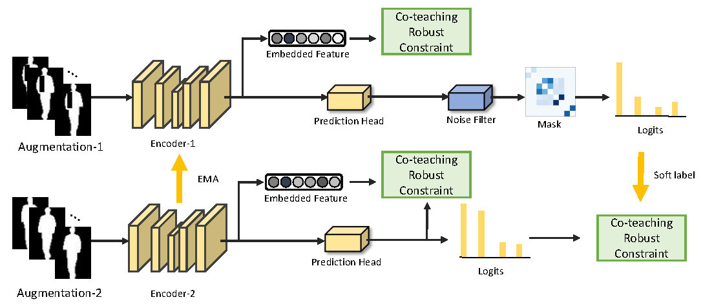

### CNTN

# How to install
A suitable conda environment named `noisy_gait` can be created and activated with:

```
conda env create -f noisy_gait.yaml
conda activate noisy_gait
```

# Dataset
First please download the original data.
CASIA-B  http://www.cbsr.ia.ac.cn/GaitDatasetB-silh.zip
OUMVLP  http://www.am.sanken.osaka-u.ac.jp/BiometricDB/GaitMVLP.html
Outdoor-Gait  https://drive.google.com/drive/folders/1XRWq40G3Zk03YaELywxuVKNodul4TziG

To create a noisy labels gait dataset on CL condition, use the following operation 
```
python add_noisy_labels.py --src_dir CASIA-B --des_dir Noisy-CL-CASIA-B --noise_rate your_noise_rate
```
To create a noisy appearance gait dataset, use the following operation, choose the appearance typr as dilate or erode. The default probability is 0.5, the default position is [8,56]
```
python add_noisy_appearances.py --src_dir CASIA-B --des_dir Noisy-CL-CASIA-B --noise_rate your_noise_rate --clothdilate True --clotherode False
```
To create a random label noise gait dataset, use the following operation 
```
python add_noisy_randm.py --src_dir CASIA-B --des_dir Noisy-CL-CASIA-B --noise_rate your_noise_rate
```

# Run the code
You can choose the model zoo e.g. GaitSet, GaitGL in the ./config/XXX.yaml and uncomment the corresponding command in train.sh. Then,
train the model by
'''
sh train.sh
'''
test the model by
'''
sh test.sh
'''

# Acknowledgement
We appreciate the wonderful base implementation from [Fan etal.](https://github.com/ShiqiYu/OpenGait) and their effort for keeping updates of this code base. 

